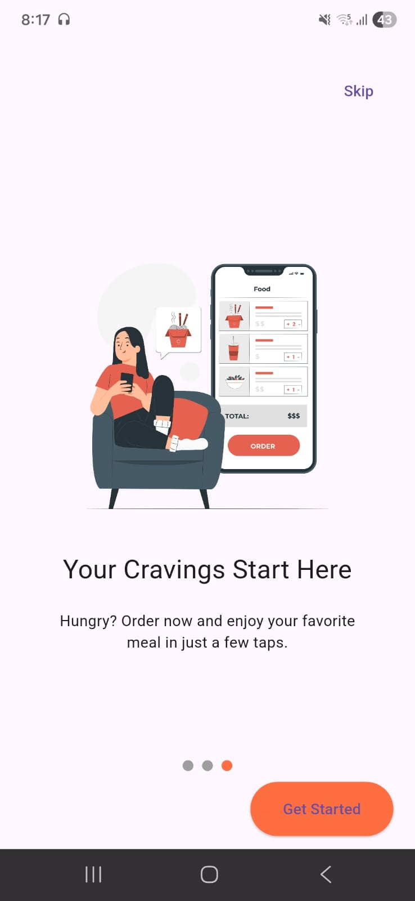
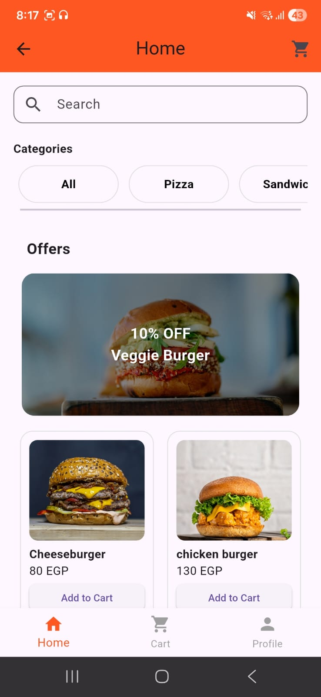
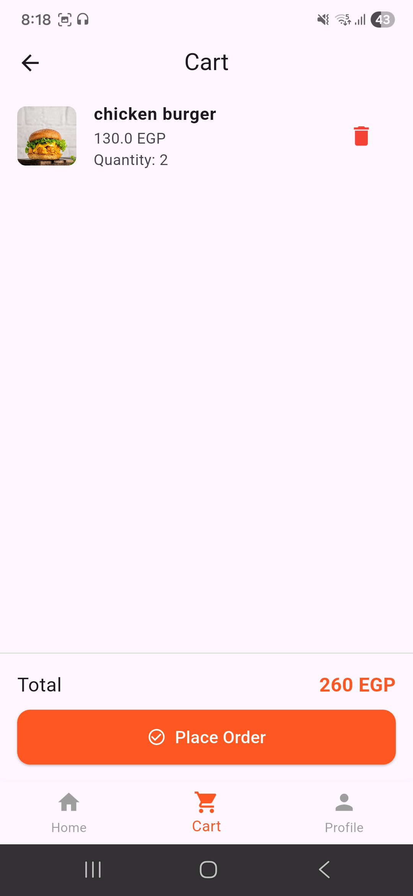
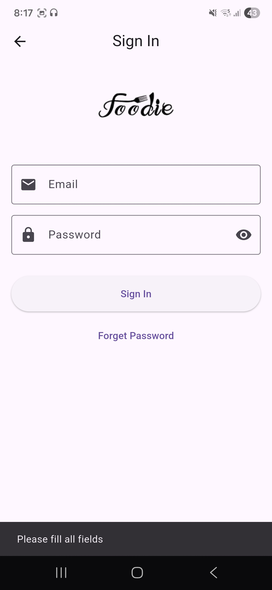
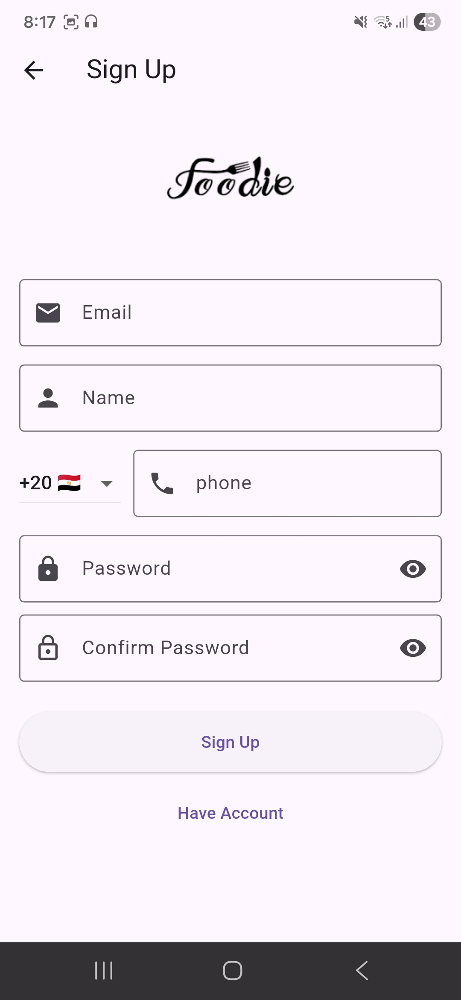
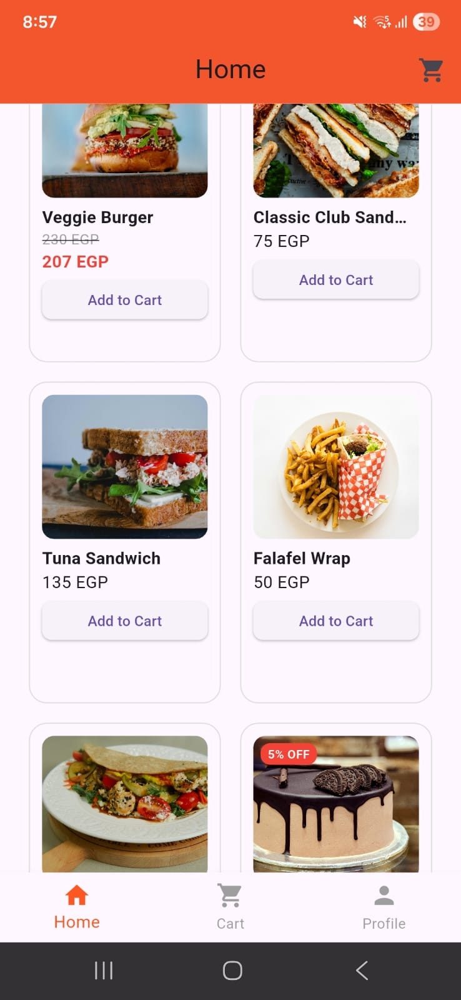

# 🍔 Foodie App

A modern food ordering mobile application built with **Flutter** and **Firebase**.

---

## 🚀 Features

* 🔐 User Authentication (Sign Up / Sign In)
* 🏠 Home Page with Categories & Offers
* 🔍 Search Bar for products
* 🍕 Product Listing from Firebase
* 🎯 Offers section (dynamic from Firestore)
* 🛒 Cart system
* 📱 Bottom Navigation Bar (Home / Cart / Profile)
* 🌍 Multi-language support (English & Arabic)

---

## 🛠️ Technologies Used

* **Flutter**
* **Firebase Authentication**
* **Cloud Firestore**
* **Firebase Storage**
* **Easy Localization**

---

## 📂 Project Structure

lib/
├── home.dart
├── main.dart
├── product.dart
├── cart.dart
├── profile.dart
├── signin.dart
├── signup.dart
├── offers.dart
├── category.dart

---

## 📸 Screenshots

<p align="center">
  
  
  

  
  
  



</p>

---

## ⚙️ Getting Started

1. Clone the repository:

```bash
git clone https://github.com/AliaaMamdouh6/foodie-app.git
```

2. Install dependencies:

```bash
flutter pub get
```

3. Run the app:

```bash
flutter run
```

---

## 🔥 Firebase Setup

* Create a Firebase project
* Enable Authentication (Email/Password)
* Create Firestore database
* Add your `google-services.json` file

---

## 🎯 Future Improvements

* 💳 Payment integration
* 🔔 Push notifications
* ❤️ Favorites feature
* 📦 Order tracking system

---

## 👨‍💻 Author

Aliaa Mamdouh

---

## ⭐ Don't forget to star the repo if you like it!
